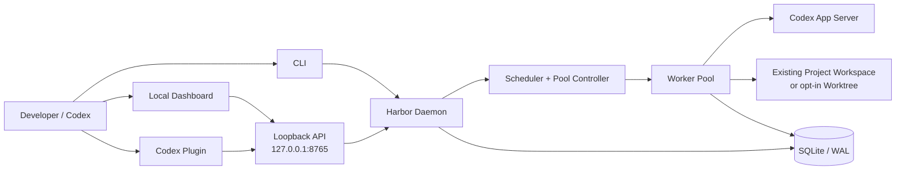
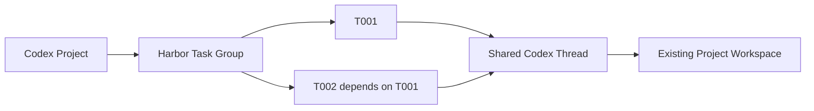
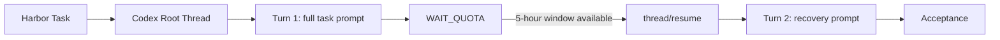

<div align="center">

# ⚓ Codex Harbor

### Durable task orchestration for Codex

Turn Codex sessions into persistent, schedulable coding tasks—with durable state,
Codex Project integration, reusable workspaces, quota-aware execution, and
recovery across processes.

[](https://github.com/Colin-Cai0318/codex-harbor/actions/workflows/ci.yml)
[](https://www.python.org/)
[](LICENSE)
[](#project-status)
[](#requirements)

**English** · [简体中文](README.zh-CN.md)

</div>

---

Codex Harbor is a local-first control plane built on top of Codex App Server.
SQLite preserves control-plane state, Codex Projects keep threads visible in the
Desktop app, and recovery envelopes keep task identity independent of a terminal,
worker, Codex process, or sidebar.

> [!IMPORTANT]
> Codex Harbor is an MVP. Windows Native is currently beta, and live quota
> behavior should be revalidated after upgrading the Codex CLI.

## Table of contents

- [Why Codex Harbor?](#why-codex-harbor)
- [Architecture](#architecture)
- [Task, session, and turn model](#task-session-and-turn-model)
- [Features](#features)
- [Requirements](#requirements)
- [Quick start](#quick-start)
- [Create a task from a Codex Project](#create-a-task-from-a-codex-project)
- [Configuration](#configuration)
- [Task files](#task-files)
- [CLI reference](#cli-reference)
- [Codex plugin](#codex-plugin)
- [Persistence and recovery](#persistence-and-recovery)
- [Development and verification](#development-and-verification)
- [Safety boundaries](#safety-boundaries)
- [Project status](#project-status)

## Why Codex Harbor?

A normal interactive Codex session is tied to a running client. Harbor gives
long-running and multi-repository work a durable lifecycle:

| Need | Harbor behavior |
|---|---|
| Survive restarts | Persists tasks, attempts, Codex threads, workers, quota, and events in SQLite/WAL |
| Use the same code as Codex | Defaults to the existing Project/conversation workspace; isolated worktrees are opt-in |
| Respect ordering | Supports dependencies, priority + FIFO ordering, and exclusive groups |
| Handle quota pauses | Uses separate task and pool state machines with wait, drain, freeze, and resume states |
| Keep agent choices explicit | Validates model/reasoning capabilities dynamically; never silently falls back |
| Prove completion | Runs acceptance commands and can feed failures back into bounded follow-up turns |

## Architecture



The daemon owns one shared App Server process. Workers retain task-scoped model
and reasoning configuration. Tasks that write to the same existing workspace
are automatically serialized even when the global worker limit is greater than one.

## Task, session, and turn model

Harbor does not replace Codex sessions. It schedules work into durable Codex
threads created through App Server and assigns them to the matching Codex
Project. The transcript remains in Codex's own thread store and is visible in
the app as `[T001] Task title` or `[G001] Group title`. Harbor's dashboard adds
lifecycle and quota control; it is not a second chat-history implementation.

| Harbor/Codex object | Meaning | Lifetime |
|---|---|---|
| Task | Business objective, repository, prompt, acceptance, dependencies, and scheduling state | Until explicitly deleted |
| Codex Project | App-owned collection of roots and durable threads | Shared by Codex and Harbor |
| Root Thread | A durable Codex session and conversation history | One task normally owns it; a task chain may share it |
| Recovery Thread | A fork/new thread used only if the prior thread cannot be resumed | Linked to the same Task |
| Turn | One prompt execution inside a Thread | Recorded with its Thread and execution number |
| Counted failure | A runtime or acceptance failure that consumes the configured retry budget | Separate from the Turn count |

The default mapping is one Task to one Root Thread, with multiple Turns over
time. A shared-session group instead links several ordered Tasks to the same
Thread: after T001 succeeds, Harbor injects T002's new objective into T001's
session, preserving its conversation context. Acceptance feedback and
quota-reset recovery prompts are also injected as later Turns in the same
Thread. Quota exhaustion is recorded as `WAIT_QUOTA`; its Turn remains visible,
but it does not increment the counted-failure budget.





If the daemon or App Server stops while waiting, SQLite retains the Task ↔
Thread mapping. After restart, the scheduler waits for the persisted reset time
and live quota availability, then calls `thread/resume` before starting the next
Turn. It does not create a detached replacement session merely because quota
was exhausted.

If an upstream task fails terminally, dependent tasks become `BLOCKED` with an
`UPSTREAM_FAILED` reason. Retrying the upstream task moves its dependants back
to `WAIT_DEP`; successful completion releases the next prompt. `WAIT_QUOTA` is
not terminal and therefore does not block the chain permanently.

## Features

### Persistent scheduling

- Durable repositories, tasks, dependencies, attempts, threads, workers, quota,
  pool state, and event records.
- Transactional task admission with priority/FIFO ordering.
- Dependency gates, terminal-failure propagation, shared-session task groups,
  parallel workers, bounded retry, and acceptance-command follow-up.
- Independent task states such as `WAIT_QUOTA`, `RETRY_WAIT`, and `BLOCKED`, plus
  pool states such as `DRAINING` and `FROZEN`.
- A runtime-adjustable, persisted maximum parallel-task limit (1–64).

### Native Codex integration

- Implements App Server initialization and durable thread/turn operations.
- Discovers Codex Projects by their root, assigns new threads with `projectId`,
  and can bind the originating Codex conversation to the same Project.
- Starts, reads, resumes, and forks Codex threads without relying on internal
  rollout JSONL files.
- Loads the live model registry and validates reasoning-effort support.
- Reads structured account rate limits through the current App Server protocol.

### Isolation, recovery, and observability

- Uses the originating conversation workspace (or registered repository root)
  by default; creates `harbor/<task-id>` worktrees only in isolated mode.
- Supports local Linux, Windows Native, and WSL execution backends.
- Persists recovery envelopes and detects stale worker heartbeats.
- Captures task history and command output after redacting authorization,
  API-key, cookie, and password material.
- Provides a loopback-only FastAPI service and a card-based lifecycle dashboard
  with light/dark themes and a persistent English/Simplified Chinese language
  selector. Quota cards emphasize the remaining allowance.

## Requirements

- Python 3.11 or newer
- [uv](https://docs.astral.sh/uv/)
- Git
- An installed and authenticated Codex CLI

Harbor currently targets Windows Native, Linux Native, and WSL2. Windows Native
is beta; see [Project status](#project-status) for qualification boundaries.

## Quick start

### 1. Clone and install

```bash
git clone https://github.com/Colin-Cai0318/codex-harbor.git
cd codex-harbor
uv sync --extra dev
```

### 2. Initialize and verify the runtime

```bash
uv run harbor init
uv run harbor doctor
```

### 3. Start Harbor

```bash
uv run harbor daemon
```

Open <http://127.0.0.1:8765> for the dashboard, or inspect the same state from
another terminal. Click **New task**, choose the same Codex Project used in the
desktop app, then either choose one of its conversations or create a new one.
Enter one task message and send it—no repository registration or extra prompt
template is required in this flow.

### 4. Inspect persistent state

```bash
uv run harbor ps
uv run harbor task show T001
uv run harbor history T001
```

## Create a task from a Codex Project

The dashboard now follows the Codex desktop mental model:

1. Select a **Codex Project**. Harbor loads that Project's durable conversations.
2. Select **Existing conversation** to continue its context and cwd, or **New
   conversation** to create a durable Codex conversation immediately.
3. For a new conversation, add one or more absolute workspace directories and
   select the primary one. The primary directory must be inside a Git checkout;
   additional directories are sent as Codex runtime workspace roots.
4. Enter the same message you would send in Codex and click **Send task**.

Harbor resolves and registers the primary Git root internally. A new conversation
is assigned to the selected Project and appears in Codex as `[Txxx] title`. An
existing conversation keeps its current name, full history, cwd, and Thread ID.
The first Turn receives the task message verbatim. Quota recovery or mechanical
verification failure may add a later recovery Turn to that same conversation.

### Advanced fields

- **Model and reasoning** are agent settings, not prompt templates. Leaving them
  empty inherits Codex defaults.
- **Optional verification commands** run after a successful Turn. Leave them
  empty when normal Codex completion is enough; use them for deterministic checks
  such as `uv run pytest -q` or `git diff --check`.
- **Dependencies, priority, retry limit, and backend** control scheduling only.

The removed repository, workspace mode, origin Thread, parent workspace, and
session-parent fields remain accepted by the legacy CLI/API for compatibility,
but they are no longer needed for normal dashboard creation.

### BossHunter example

Open BossHunter in Codex as a Project rooted at `F:\BossHunter`, start Harbor,
then choose **BossHunter → Existing conversation** (or **New conversation** with
`F:\BossHunter` as its primary directory) and send:

```text
Review the existing README and document installation, startup, and verification without changing business code.
```

No GitHub URL is entered in Harbor. Git continues to manage
[`Colin-Cai0318/BossHunter`](https://github.com/Colin-Cai0318/BossHunter) as the
checkout's remote.

### Legacy CLI registration

Scripted/YAML workflows still use explicit repository registration:

```powershell
uv run harbor repo add "F:\BossHunter"
uv run harbor repo list
uv run harbor task add --repo "F:\BossHunter" --title "README" --prompt "Improve the README" --workspace-mode project
```

`repo add` accepts a local Git checkout, not a GitHub URL, and never clones or
copies the repository. The CLI and daemon must share the same configuration and
`HARBOR_DATA_DIR`.

## Configuration

The generated configuration follows [`config.example.toml`](config.example.toml).
Important defaults are deliberately conservative:

| Setting | Default | Purpose |
|---|---:|---|
| `harbor.bind` | `127.0.0.1` | Keeps the dashboard and API on loopback |
| `harbor.port` | `8765` | Local dashboard/API port |
| `scheduler.max_workers` | `3` | Maximum concurrent workers |
| `quota.provider` | `codex` | Reads structured Codex account rate limits |
| `quota.freeze_on_weekly_reset` | `true` | Drains grandfathered work before freezing at a weekly reset |
| `codex.approval_policy` | `never` | Prevents unattended workers from hanging on approval prompts |
| `codex.sandbox` | `workspace-write` | Restricts agent writes to its task workspace |

`scheduler.max_workers` seeds a new database. After initialization, the value
can be changed live from the dashboard and is retained in Harbor's database.

Use an isolated data directory when testing another Harbor instance:

```powershell
$env:HARBOR_DATA_DIR = 'D:\harbor-data'
uv run harbor init
```

## Task files

Tasks can be created individually or imported from YAML. The default
`workspace_mode: project` uses the registered checkout rather than creating a
new worktree:

```bash
uv run harbor task import docs/task-example.yaml
```

```yaml
id: T001
title: Add watchdog parser
repository:
  path: /absolute/path/to/repository
execution:
  backend: local
agent:
  model: null
  reasoning_effort: high
priority: 50
depends_on: []
exclusive_group: watchdog-parser
prompt: Implement the parser and preserve existing behavior.
acceptance:
  commands:
    - pytest tests/watchdog -q
max_attempts: 5
workspace_mode: project
```

Lower priority numbers run first; tasks with equal priority use FIFO order.
`max_attempts` is the counted-failure retry limit; quota-wait Turns do not
consume it.

### Ordered tasks in one Codex session

From the Codex Harbor plugin/skill or any loopback client, create a task group:

```powershell
$body = @{
  title = "Codex Harbor follow-up development"
  repository = "E:\Tools\Codex_Harbor"
  session_mode = "shared"
  workspace_mode = "project"
  sequential = $true
  codex_project_id = "<Codex Project ID>"
  origin_thread_id = "<current Codex conversation ID>"
  tasks = @(
    @{ title = "Database"; prompt = "Implement the database changes"; priority = 10; acceptance_commands = @("uv run pytest -q") },
    @{ title = "Scheduler"; prompt = "Continue in the preceding task's session and implement the scheduler"; priority = 20; acceptance_commands = @("uv run pytest -q") }
  )
} | ConvertTo-Json -Depth 6

Invoke-RestMethod -Method Post `
  -Uri "http://127.0.0.1:8765/api/task-groups" `
  -ContentType "application/json" -Body $body
```

`shared` means each later Task reuses the preceding Task's Codex Thread.
`isolated` gives each Task its own Thread. `project` reuses the existing checkout;
`isolated` workspace mode creates a Harbor-owned worktree. Sequential groups
automatically add T002 → T001 dependencies and inject the next prompt only after
the predecessor succeeds.

The same operation is available as a copyable YAML workflow:

```powershell
Copy-Item docs\task-group-example.yaml .\my-task-group.yaml
# Edit the repository, prompts, Project ID, and optional origin Thread ID.
uv run harbor task group-import .\my-task-group.yaml
```

## CLI reference

| Command | Purpose |
|---|---|
| `harbor init` | Create the data directory, database, and default configuration |
| `harbor repo add\|list` | Register or list eligible Git repositories |
| `harbor task add\|import\|group-import\|list\|show` | Create individual tasks or an atomic task group, then inspect them |
| `harbor task config` | Change the task model or reasoning effort |
| `harbor task retry\|cancel\|cleanup` | Control task lifecycle and owned worktrees |
| `harbor ps` | Show pool, workers, and active tasks |
| `harbor quota` | Show the latest persisted quota windows |
| `harbor pause\|freeze\|resume` | Control pool admission |
| `harbor run` | Run the scheduler until the current work is settled |
| `harbor daemon` | Run the scheduler and local dashboard continuously |
| `harbor logs TASK` | Read persisted task output |
| `harbor history TASK` | Read the task event timeline |
| `harbor doctor` | Validate Python, Git, SQLite, Codex, models, quota, and execution backends |

Run `uv run harbor <command> --help` for complete arguments.

## Codex plugin

The repository includes a validated development plugin at
[`integrations/plugins/codex-harbor`](integrations/plugins/codex-harbor). Its
`harbor-tasks` skill lets Codex inspect and manage the pool through Harbor's
loopback API while preserving the same scheduler and safety boundaries as the
CLI and dashboard.

The API contract and a dependency-free helper are included under the plugin's
[`references`](integrations/plugins/codex-harbor/skills/harbor-tasks/references/api.md)
and [`scripts`](integrations/plugins/codex-harbor/skills/harbor-tasks/scripts/harbor_api.py)
directories.

## Persistence and recovery

Harbor treats SQLite as the control-plane source of truth and a Codex thread as
durable execution context. The Phase 0 proof starts an App Server process,
completes a turn, stops the process, starts a different process, resumes the
same thread, reads its persisted history, and completes another turn:

```bash
uv run python tools/app_server_poc.py --workspace .
```

Machine-local proof data is written to `.codex-harbor-poc/state.json` and is
ignored by Git.

## Development and verification

```bash
uv run pytest -q
uv run pytest --cov=codex_harbor --cov-report=term-missing
uv run python -m compileall -q src tools tests
uv run harbor doctor
```

The CI matrix covers Ubuntu and Windows with Python 3.11 and 3.13. Deterministic
tests use fake runtimes and quota providers; the App Server proof is the live
integration gate.

- [Implementation map](docs/IMPLEMENTATION.md)
- [Validation record](docs/VALIDATION.md)
- [Example task](docs/task-example.yaml)
- [Shared-session task-group example](docs/task-group-example.yaml)

## Safety boundaries

> [!WARNING]
> Harbor deliberately does not auto-merge task branches or delete successful
> worktrees. Cleanup is always explicit.

- SQLite—not chat history—is the control-plane source of truth.
- Task state and pool state remain separate.
- Quota exhaustion is a wait state and recorded Turn, not a counted failure.
- Unsupported model capabilities block a task instead of changing its model.
- Codex authentication remains owned by Codex; Harbor does not store its secrets.
- Existing Project workspaces are never removed by `task cleanup`. Cleanup only
  accepts an exact Harbor-owned isolated worktree and preserves its branch.
- The API binds to loopback by default and never defaults to `0.0.0.0`.

## Project status

Codex Harbor v0.1 is a working MVP. Automated tests, a real two-process App
Server recovery proof, a real isolated worktree task, and the loopback API have
been validated on Windows Native.

The following remain release-qualification work and are not claimed as fully
validated: a real 5-hour/weekly quota exhaustion cycle, destructive process-kill
and host-reboot testing, Linux/WSL host soak testing, and Windows service
packaging. See the [validation record](docs/VALIDATION.md) for exact evidence.

## License

Licensed under the [Apache License 2.0](LICENSE).
