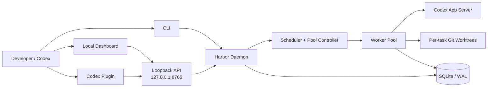

<div align="center">

# ⚓ Codex Harbor

### Durable task orchestration for Codex

Turn Codex sessions into persistent, schedulable coding tasks—with durable state,
isolated Git worktrees, quota-aware execution, and recovery across processes.

[](https://github.com/Colin-Cai0318/codex-harbor/actions/workflows/ci.yml)
[](https://www.python.org/)
[](LICENSE)
[](#project-status)
[](#requirements)

**English** · [简体中文](README.zh-CN.md)

</div>

---

Codex Harbor is a local-first control plane built on top of Codex App Server.
SQLite preserves control-plane state, Git worktrees isolate code changes, and
recovery envelopes keep task identity independent of a terminal, worker,
Codex process, or Desktop sidebar.

> [!IMPORTANT]
> Codex Harbor is an MVP. Windows Native is currently beta, and live quota
> behavior should be revalidated after upgrading the Codex CLI.

## Table of contents

- [Why Codex Harbor?](#why-codex-harbor)
- [Architecture](#architecture)
- [Features](#features)
- [Requirements](#requirements)
- [Quick start](#quick-start)
- [Configuration](#configuration)
- [Task files](#task-files)
- [CLI reference](#cli-reference)
- [Codex plugin](#codex-plugin)
- [Persistence and recovery](#persistence-and-recovery)
- [Development and verification](#development-and-verification)
- [Safety boundaries](#safety-boundaries)
- [Project status](#project-status)

## Why Codex Harbor?

A normal interactive Codex session is tied to a running client. Harbor gives
long-running and multi-repository work a durable lifecycle:

| Need | Harbor behavior |
|---|---|
| Survive restarts | Persists tasks, attempts, Codex threads, workers, quota, and events in SQLite/WAL |
| Run safely in parallel | Claims tasks transactionally and gives each task its own Git worktree |
| Respect ordering | Supports dependencies, priority + FIFO ordering, and exclusive groups |
| Handle quota pauses | Uses separate task and pool state machines with wait, drain, freeze, and resume states |
| Keep agent choices explicit | Validates model/reasoning capabilities dynamically; never silently falls back |
| Prove completion | Runs acceptance commands and can feed failures back into bounded follow-up turns |

## Architecture



The daemon owns one shared App Server process. Workers retain task-scoped model
and reasoning configuration, so agent state never leaks between tasks.

## Features

### Persistent scheduling

- Durable repositories, tasks, dependencies, attempts, threads, workers, quota,
  pool state, and event records.
- Transactional task admission with priority/FIFO ordering.
- Dependency gates, exclusive groups, parallel workers, bounded retry, and
  acceptance-command follow-up.
- Independent task states such as `WAIT_QUOTA`, `RETRY_WAIT`, and `BLOCKED`, plus
  pool states such as `DRAINING` and `FROZEN`.

### Native Codex integration

- Implements App Server initialization and durable thread/turn operations.
- Starts, reads, resumes, and forks Codex threads without relying on internal
  rollout JSONL files.
- Loads the live model registry and validates reasoning-effort support.
- Reads structured account rate limits through the current App Server protocol.

### Isolation, recovery, and observability

- Creates `harbor/<task-id>` branches in Harbor-owned Git worktrees.
- Supports local Linux, Windows Native, and WSL execution backends.
- Persists recovery envelopes and detects stale worker heartbeats.
- Captures task history and command output after redacting authorization,
  API-key, cookie, and password material.
- Provides a loopback-only FastAPI service and lightweight dashboard.

## Requirements

- Python 3.11 or newer
- [uv](https://docs.astral.sh/uv/)
- Git
- An installed and authenticated Codex CLI

Harbor currently targets Windows Native, Linux Native, and WSL2. Windows Native
is beta; see [Project status](#project-status) for qualification boundaries.

## Quick start

### 1. Clone and install

```bash
git clone https://github.com/Colin-Cai0318/codex-harbor.git
cd codex-harbor
uv sync --extra dev
```

### 2. Initialize and verify the runtime

```bash
uv run harbor init
uv run harbor doctor
```

### 3. Register a repository and create a task

Harbor only operates on explicitly registered Git repositories.

```bash
uv run harbor repo add /path/to/project

uv run harbor task add \
  --repo /path/to/project \
  --title "Add parser" \
  --prompt "Implement the parser and preserve existing behavior" \
  --reasoning high \
  --accept "pytest -q"
```

PowerShell users can place the command on one line or use the backtick as the
line-continuation character.

### 4. Start Harbor

```bash
uv run harbor daemon
```

Open <http://127.0.0.1:8765> for the dashboard, or inspect the same state from
another terminal:

```bash
uv run harbor ps
uv run harbor task show T001
uv run harbor history T001
```

## Configuration

The generated configuration follows [`config.example.toml`](config.example.toml).
Important defaults are deliberately conservative:

| Setting | Default | Purpose |
|---|---:|---|
| `harbor.bind` | `127.0.0.1` | Keeps the dashboard and API on loopback |
| `harbor.port` | `8765` | Local dashboard/API port |
| `scheduler.max_workers` | `3` | Maximum concurrent workers |
| `quota.provider` | `codex` | Reads structured Codex account rate limits |
| `quota.freeze_on_weekly_reset` | `true` | Drains grandfathered work before freezing at a weekly reset |
| `codex.approval_policy` | `never` | Prevents unattended workers from hanging on approval prompts |
| `codex.sandbox` | `workspace-write` | Restricts agent writes to its task workspace |

Use an isolated data directory when testing another Harbor instance:

```powershell
$env:HARBOR_DATA_DIR = 'D:\harbor-data'
uv run harbor init
```

## Task files

Tasks can be created individually or imported from YAML:

```bash
uv run harbor task import docs/task-example.yaml
```

```yaml
id: T001
title: Add watchdog parser
repository:
  path: /absolute/path/to/repository
execution:
  backend: local
agent:
  model: null
  reasoning_effort: high
priority: 50
depends_on: []
exclusive_group: watchdog-parser
prompt: Implement the parser and preserve existing behavior.
acceptance:
  commands:
    - pytest tests/watchdog -q
max_attempts: 5
```

Lower priority numbers run first; tasks with equal priority use FIFO order.

## CLI reference

| Command | Purpose |
|---|---|
| `harbor init` | Create the data directory, database, and default configuration |
| `harbor repo add\|list` | Register or list eligible Git repositories |
| `harbor task add\|import\|list\|show` | Create and inspect tasks |
| `harbor task config` | Change the task model or reasoning effort |
| `harbor task retry\|cancel\|cleanup` | Control task lifecycle and owned worktrees |
| `harbor ps` | Show pool, workers, and active tasks |
| `harbor quota` | Show the latest persisted quota windows |
| `harbor pause\|freeze\|resume` | Control pool admission |
| `harbor run` | Run the scheduler until the current work is settled |
| `harbor daemon` | Run the scheduler and local dashboard continuously |
| `harbor logs TASK` | Read persisted task output |
| `harbor history TASK` | Read the task event timeline |
| `harbor doctor` | Validate Python, Git, SQLite, Codex, models, quota, and execution backends |

Run `uv run harbor <command> --help` for complete arguments.

## Codex plugin

The repository includes a validated development plugin at
[`integrations/plugins/codex-harbor`](integrations/plugins/codex-harbor). Its
`harbor-tasks` skill lets Codex inspect and manage the pool through Harbor's
loopback API while preserving the same scheduler and safety boundaries as the
CLI and dashboard.

The API contract and a dependency-free helper are included under the plugin's
[`references`](integrations/plugins/codex-harbor/skills/harbor-tasks/references/api.md)
and [`scripts`](integrations/plugins/codex-harbor/skills/harbor-tasks/scripts/harbor_api.py)
directories.

## Persistence and recovery

Harbor treats SQLite as the control-plane source of truth and a Codex thread as
durable execution context. The Phase 0 proof starts an App Server process,
completes a turn, stops the process, starts a different process, resumes the
same thread, reads its persisted history, and completes another turn:

```bash
uv run python tools/app_server_poc.py --workspace .
```

Machine-local proof data is written to `.codex-harbor-poc/state.json` and is
ignored by Git.

## Development and verification

```bash
uv run pytest -q
uv run pytest --cov=codex_harbor --cov-report=term-missing
uv run python -m compileall -q src tools tests
uv run harbor doctor
```

The CI matrix covers Ubuntu and Windows with Python 3.11 and 3.13. Deterministic
tests use fake runtimes and quota providers; the App Server proof is the live
integration gate.

- [Implementation map](docs/IMPLEMENTATION.md)
- [Validation record](docs/VALIDATION.md)
- [Example task](docs/task-example.yaml)

## Safety boundaries

> [!WARNING]
> Harbor deliberately does not auto-merge task branches or delete successful
> worktrees. Cleanup is always explicit.

- SQLite—not chat history—is the control-plane source of truth.
- Task state and pool state remain separate.
- Quota exhaustion is a wait state, not a failed attempt.
- Unsupported model capabilities block a task instead of changing its model.
- Codex authentication remains owned by Codex; Harbor does not store its secrets.
- `task cleanup` validates the registered Git root and removes only the exact
  Harbor-owned worktree; it preserves the branch.
- The API binds to loopback by default and never defaults to `0.0.0.0`.

## Project status

Codex Harbor v0.1 is a working MVP. Automated tests, a real two-process App
Server recovery proof, a real isolated worktree task, and the loopback API have
been validated on Windows Native.

The following remain release-qualification work and are not claimed as fully
validated: a real 5-hour/weekly quota exhaustion cycle, destructive process-kill
and host-reboot testing, Linux/WSL host soak testing, and Windows service
packaging. See the [validation record](docs/VALIDATION.md) for exact evidence.

## License

Licensed under the [Apache License 2.0](LICENSE).
