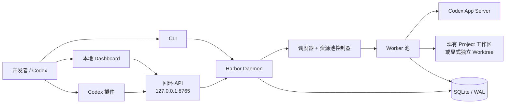
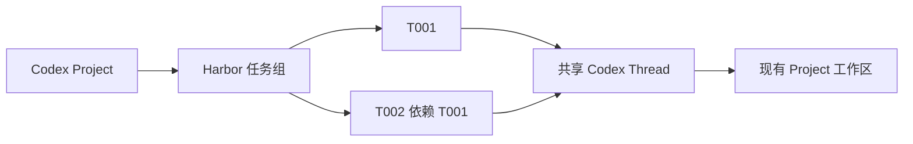
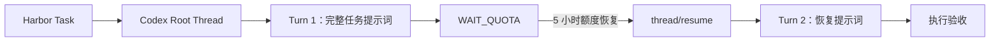

<div align="center">

# ⚓ Codex Harbor（代码港）

### 面向 Codex 的持久化任务编排器

将 Codex 会话变成可持久化、可调度的开发任务，并提供 Codex Project 集成、
现有工作区复用、配额感知执行以及跨进程恢复能力。

[](https://github.com/Colin-Cai0318/codex-harbor/actions/workflows/ci.yml)
[](https://www.python.org/)
[](LICENSE)
[](#项目状态)
[](#环境要求)

[English](README.md) · **简体中文**

</div>

## 当前对话自动恢复

将 `integrations/plugins/codex-harbor/skills/harbor-auto-resume` 复制到
`$CODEX_HOME/skills/harbor-auto-resume`（未设置时为 `~/.codex/skills/`），
在 Codex 中说“自动恢复当前任务”。技能立即向本机 Harbor 登记保护，默认在
5h 用量达到 95% 时创建绑定原 Thread ID 的 task。只有原轮次确实因额度失败，
且额度恢复后才执行；原轮次正常完成则撤销保护。Harbor 服务需要保持运行。

登记和 task 创建不依赖模型。开启 `PATCH /api/recovery-settings` 的
`allow_luna_reserve: true` 后，若 5h 额度已耗尽且尚未创建 task，Harbor 可在原对话
使用新版 **Luna Reserve**（实际模型标识 `gpt-reserve`、推理等级 `xhigh`）补写续接
摘要并创建 task，每次保护最多一轮。普通 `gpt-5.6-luna` 与该储备入口不同。
已有 task 时不消耗储备；储备不可用时仍直接创建 task。后续工作保留原主模型配置。

`GET/POST /api/recovery-watches` 用于查询/登记保护，
`POST /api/recovery-watches/{id}/cancel` 用于取消。
重复登记同一对话不会创建多个有效保护。

普通手动续接使用 `POST /api/tasks`，传入 `conversation_mode: "existing"`、
`thread_id` 和 `message`，可不提供 Project ID。`origin_thread_id` 单独使用仅记录
来源，不代表续接。明确选择的原对话恢复失败时不会 fork 或另开对话。

每个 worker 使用独立 App Server，执行结束或等待额度时关闭，从而释放对话写入权。
执行中的对话仍可能在桌面显示被占用；桌面仍持有写入权时 Harbor 每分钟重试原对话，
不消耗失败次数。新对话在 worker 首次执行时才创建，排队期间 Thread ID 可为空。

参见 [本次审阅与验证](docs/REVIEW-2026-09-07.md)。

---

Codex Harbor 是构建在 Codex App Server 之上的本地优先控制平面。它使用
SQLite 保存调度状态、Codex Project 让对话继续显示在 Codex 应用中，并通过
恢复信封确保任务身份不依赖某个终端、Worker、Codex 进程或侧边栏。

> [!IMPORTANT]
> Codex Harbor 当前为 MVP。Windows Native 仍处于 Beta 阶段；升级 Codex CLI
> 后，应重新验证真实配额行为。

## 目录

最新维护审查：[2026 年 9 月问题与修复记录](docs/REVIEW-2026-09-06.md)。
真实执行验证：[Luna 全量测试结果与复现命令](docs/LUNA-E2E-2026-09-06.md)。
部署边界与漏洞反馈：[安全说明](SECURITY.md)。

- [为什么需要 Codex Harbor？](#为什么需要-codex-harbor)
- [系统架构](#系统架构)
- [TaskSession 与 Turn 的关系](#tasksession-与-turn-的关系)
- [核心能力](#核心能力)
- [环境要求](#环境要求)
- [快速开始](#快速开始)
- [从 Codex 项目创建任务](#从-codex-项目创建任务)
- [配置说明](#配置说明)
- [YAML 任务文件](#yaml-任务文件)
- [CLI 命令参考](#cli-命令参考)
- [Codex 插件](#codex-插件)
- [持久化与恢复](#持久化与恢复)
- [开发与验证](#开发与验证)
- [安全边界](#安全边界)
- [项目状态](#项目状态)

## 为什么需要 Codex Harbor？

普通的交互式 Codex 会话依赖正在运行的客户端。Harbor 为长时间、多仓库开发
任务提供了独立且持久的生命周期：

| 需求 | Harbor 的处理方式 |
|---|---|
| 跨进程恢复 | 在 SQLite/WAL 中保存任务、Attempt、Codex Thread、Worker、配额和事件 |
| 和 Codex 使用同一份代码 | 默认复用 Project/当前对话已有工作区，独立 worktree 改为显式选项 |
| 保证执行顺序 | 支持依赖关系、优先级 + FIFO 以及互斥组 |
| 应对配额暂停 | 任务状态机与资源池状态机分离，支持等待、排空、冻结和恢复 |
| 明确 Agent 配置 | 动态校验模型与推理等级能力，绝不静默降级 |
| 验证完成质量 | 执行验收命令，并可将失败结果交给后续 Turn 继续修复 |

## 系统架构



Daemon 统一管理一个 App Server 进程。模型和推理等级配置始终归属于具体任务。
即使全局并行数大于 1，写入同一个现有工作区的任务也会自动串行执行。

## Task、Session 与 Turn 的关系

Harbor 不会替代或绕开 Codex Session。它通过 App Server 把任务调度到持久化的
Codex Thread 中，并把 Thread 归入匹配的 Codex Project。对话记录仍保存在 Codex
自己的 Thread 存储里，在应用中显示为 `[T001] 任务标题` 或 `[G001] 任务组标题`。
Harbor Dashboard 负责补充生命周期、并发和额度控制，并不是另一套聊天记录系统。

| Harbor/Codex 对象 | 含义 | 生命周期 |
|---|---|---|
| Task | 业务目标、仓库、提示词、验收标准、依赖和调度状态 | 直到被显式删除 |
| Codex Project | 由 Codex 应用管理的工作区根目录与持久化 Thread 集合 | Codex 与 Harbor 共同使用 |
| Root Thread | 持久化 Codex Session 和对话历史 | 默认一个任务独享；也可由任务链共享 |
| Recovery Thread | 旧版未指定对话模式的 task 可在恢复失败时 Fork；明确选择原对话时禁止 | 仍关联同一个 Task |
| Turn | Thread 内的一次提示词执行 | 与 Thread ID、执行轮次一起记录 |
| 计入预算的失败 | 会消耗失败重试上限的运行或验收失败 | 与 Turn 数量独立计算 |

默认关系是一个 Task 对应一个 Root Thread，并在其中产生多个 Turn。共享 Session
任务组则把多个有序 Task 关联到同一个 Thread：T001 成功后，Harbor 会把 T002 的
新目标注入 T001 的 Session，从而保留前文上下文。验收反馈和额度恢复提示词也会
作为后续 Turn 注入同一 Thread。额度耗尽会记录为 `WAIT_QUOTA`：这个 Turn 和错误
证据会保留，但不会增加“计入预算的失败”数量。





即使 Daemon 或 App Server 在等待期间停止，SQLite 仍会保存 Task ↔ Thread 映射。
重启后，调度器会同时等待已记录的重置时间和实时额度恢复，然后先调用
`thread/resume`，再启动下一个 Turn；不会因为额度耗尽而创建一条脱离 Codex 的
替代 Session。

如果上游任务发生终态失败，后续依赖任务会以 `UPSTREAM_FAILED` 原因进入
`BLOCKED`。重试上游后，后续任务会回到 `WAIT_DEP`；上游成功后才注入下一条
提示词。`WAIT_QUOTA` 不是终态，所以不会永久阻塞任务链。

## 核心能力

### 持久化调度

- 持久化保存仓库、任务、依赖、Attempt、Thread、Worker、配额、资源池和事件。
- 通过事务领取任务，并按优先级/FIFO 排序。
- 支持依赖门禁、终态失败向后传播、共享 Session 任务组、并行 Worker、有限重试
  和验收失败后的后续 Turn。
- 提供 `WAIT_QUOTA`、`RETRY_WAIT`、`BLOCKED` 等任务状态，以及
  `DRAINING`、`FROZEN` 等独立资源池状态。
- 支持在运行时调整并持久化最大并行任务数（1–64）。

### 原生 Codex 集成

- 实现 App Server 初始化以及持久化 Thread/Turn 操作。
- 按工作区根目录发现 Codex Project，通过 `projectId` 归档新 Thread，并可把发起
  任务的原 Codex 对话绑定到同一 Project。
- 支持创建、读取、恢复和 Fork Codex Thread，不依赖内部 rollout JSONL 格式。
- 动态读取模型列表并验证所选推理等级是否受支持。
- 通过当前 App Server 协议读取结构化账户配额。

### 隔离、恢复与可观测性

- 默认使用发起对话的现有工作区（否则使用注册仓库根目录）；仅在隔离模式创建
  `harbor/<task-id>` worktree。
- 支持本地 Linux、Windows Native 和 WSL 执行后端。
- 保存恢复信封，并根据心跳识别失联 Worker。
- 持久化任务历史和命令输出前，对 Authorization、API Key、Cookie 和密码脱敏。
- 提供仅监听回环地址的 FastAPI 服务，以及支持白天/黑夜主题和中英文持久化切换的
  卡片式生命周期 Dashboard；额度卡片以剩余额度为主信息。

## 环境要求

- Python 3.11 或更高版本
- [uv](https://docs.astral.sh/uv/)
- Git
- 已安装并完成登录的 Codex CLI

Harbor 当前面向 Windows Native、Linux Native 和 WSL2。Windows Native 仍为
Beta；完整验证边界请参阅[项目状态](#项目状态)。

## 快速开始

### 1. 克隆并安装

```bash
git clone https://github.com/Colin-Cai0318/codex-harbor.git
cd codex-harbor
uv sync --extra dev
```

### 2. 初始化并检查运行环境

```bash
uv run harbor init
uv run harbor doctor
```

### 3. 启动 Harbor

```bash
uv run harbor daemon
```

浏览器打开 <http://127.0.0.1:8765>，点击“新建任务”，选择 Codex 应用中同一个
项目，再选择已有对话或新建对话，输入一条任务消息后发送。正常使用不再要求先
注册仓库，也不需要额外的提示词模板。

### 4. 查看持久化状态

```bash
uv run harbor ps
uv run harbor task show T001
uv run harbor history T001
```

## 从 Codex 项目创建任务

Dashboard 现在直接采用 Codex 应用的使用方式：

1. 选择 **Codex 项目**，Harbor 会加载该项目内的持久化对话。
2. 选择 **已有对话** 可沿用其完整上下文和 cwd；选择 **新建对话** 会在 worker
   首次执行时创建并持久化 Codex 对话。
3. 新建对话时添加一个或多个绝对路径，并指定主目录。主目录必须位于 Git 工作区；
   其他目录会作为 Codex runtime workspace roots 一并传入。
4. 输入你本来会在 Codex 中发送的同一条消息，点击“发送任务”。

Harbor 会自动解析并注册主目录对应的 Git 根目录。新对话会归入所选 Project，
并在 Codex 应用中显示为 `[Txxx] 标题`；已有对话会保留原名称、历史、cwd 和
Thread ID。首次 Turn 会原样收到任务消息。只有额度恢复或机械验证失败时，才可能
在同一对话中追加后续恢复 Turn。

### 高级选项分别是什么？

- **模型与推理等级**是 Agent 配置，不是提示词模板；留空表示继承 Codex 默认值。
- **可选验证命令**在 Codex Turn 正常结束后执行。留空表示正常完成就算成功；
  `uv run pytest -q`、`git diff --check` 之类命令适合做确定性检查。
- **依赖、优先级、失败重试上限和执行后端**只影响任务调度。

仓库、工作区模式、来源 Thread、父任务工作区和延续哪个任务 Session 等旧字段，
仍由 CLI/API 兼容保留，但普通 Dashboard 创建不再需要它们。

### BossHunter 示例

先在 Codex 中把 `F:\BossHunter` 打开为 Project。启动 Harbor 后，选择
**BossHunter → 已有对话**；或者选择**新建对话**，把 `F:\BossHunter` 设为主目录，
再发送：

```text
检查现有 README，补充安装、启动和验证步骤；不要修改业务代码。
```

Harbor 中不填写 GitHub URL。本地 Git 仍负责维护远端
[`Colin-Cai0318/BossHunter`](https://github.com/Colin-Cai0318/BossHunter)。

### 旧版 CLI 注册方式

脚本和 YAML 工作流仍可显式注册本地 Git 仓库：

```powershell
uv run harbor repo add "F:\BossHunter"
uv run harbor repo list
uv run harbor task add --repo "F:\BossHunter" --title "README" --prompt "完善 README" --workspace-mode project
```

`repo add` 只接受本地 Git 工作区，不接受 GitHub URL，也不会 clone 或复制代码。
CLI 与 daemon 必须使用相同配置和 `HARBOR_DATA_DIR`。

## 配置说明

初始化配置结构可参考 [`config.example.toml`](config.example.toml)。关键默认值
有意保持保守：

| 配置项 | 默认值 | 用途 |
|---|---:|---|
| `harbor.bind` | `127.0.0.1` | Dashboard 与 API 仅监听本机回环地址 |
| `harbor.port` | `8765` | 本地 Dashboard/API 端口 |
| `scheduler.max_workers` | `3` | 最大并行 Worker 数量 |
| `quota.provider` | `codex` | 读取 Codex 账户的结构化配额 |
| `quota.freeze_on_weekly_reset` | `true` | 周配额重置时先排空既有任务再冻结资源池 |
| `codex.approval_policy` | `never` | 防止无人值守 Worker 卡在审批提示上 |
| `codex.sandbox` | `workspace-write` | 将 Agent 写入限制在任务工作区 |

`scheduler.max_workers` 用于初始化新数据库；初始化后可在 Dashboard 中实时修改，
新值会保存在 Harbor 数据库中。

测试另一套 Harbor 实例时，可使用独立数据目录：

```powershell
$env:HARBOR_DATA_DIR = 'D:\harbor-data'
uv run harbor init
```

## YAML 任务文件

任务既可以逐个创建，也可以从 YAML 导入。默认的
`workspace_mode: project` 使用已注册的现有工作区，不会新建 worktree：

```bash
uv run harbor task import docs/task-example.yaml
```

```yaml
id: T001
title: 新增 watchdog 解析器
repository:
  path: /absolute/path/to/repository
execution:
  backend: local
agent:
  model: null
  reasoning_effort: high
priority: 50
depends_on: []
exclusive_group: watchdog-parser
prompt: 实现解析器并保持现有行为不变。
acceptance:
  commands:
    - pytest tests/watchdog -q
max_attempts: 5
workspace_mode: project
```

优先级数字越小越先执行；相同优先级按 FIFO 排序。`max_attempts` 表示计入预算的
失败重试上限，等待额度的 Turn 不会消耗它。

### 在同一个 Codex Session 中顺序执行多个任务

可以从 Codex Harbor 插件/Skill 或任意回环客户端创建任务组：

```powershell
$body = @{
  title = "Codex Harbor 后续开发"
  repository = "E:\Tools\Codex_Harbor"
  session_mode = "shared"
  workspace_mode = "project"
  sequential = $true
  codex_project_id = "<Codex Project ID>"
  origin_thread_id = "<当前 Codex 对话 ID>"
  tasks = @(
    @{ title = "数据库修改"; prompt = "完成数据库修改"; priority = 10; acceptance_commands = @("uv run pytest -q") },
    @{ title = "调度器修改"; prompt = "沿用上一个任务的 Session，继续完成调度器修改"; priority = 20; acceptance_commands = @("uv run pytest -q") }
  )
} | ConvertTo-Json -Depth 6

Invoke-RestMethod -Method Post `
  -Uri "http://127.0.0.1:8765/api/task-groups" `
  -ContentType "application/json" -Body $body
```

`session_mode: shared` 表示后一个 Task 复用前一个 Task 的 Codex Thread；
`isolated` 表示每个 Task 使用独立 Thread。`workspace_mode: project` 复用现有代码
目录；工作区模式设为 `isolated` 才创建 Harbor worktree。有序任务组会自动添加
T002 → T001 依赖，只有前一项成功后才注入下一项提示词。

也可以使用可复制修改的 YAML：

```powershell
Copy-Item docs\task-group-example.yaml .\my-task-group.yaml
# 修改仓库路径、提示词、Project ID，以及可选的发起对话 Thread ID。
uv run harbor task group-import .\my-task-group.yaml
```

## CLI 命令参考

| 命令 | 用途 |
|---|---|
| `harbor init` | 创建数据目录、数据库和默认配置 |
| `harbor repo add\|list` | 注册或列出可用 Git 仓库 |
| `harbor task add\|import\|group-import\|list\|show` | 创建单任务或原子任务组并查看结果 |
| `harbor task config` | 调整任务的模型或推理等级 |
| `harbor task retry\|cancel\|cleanup` | 管理任务生命周期和 Harbor worktree |
| `harbor ps` | 查看资源池、Worker 和活动任务 |
| `harbor quota` | 查看最近一次持久化的配额窗口 |
| `harbor pause\|freeze\|resume` | 控制资源池任务准入 |
| `harbor run` | 运行调度器，直到当前工作稳定 |
| `harbor daemon` | 持续运行调度器与本地 Dashboard |
| `harbor logs TASK` | 查看持久化任务输出 |
| `harbor history TASK` | 查看任务事件时间线 |
| `harbor doctor` | 检查 Python、Git、SQLite、Codex、模型、配额和执行后端 |

使用 `uv run harbor <command> --help` 查看完整参数。

## Codex 插件

仓库在 [`integrations/plugins/codex-harbor`](integrations/plugins/codex-harbor)
中提供了已验证的开发版插件。其 `harbor-tasks` Skill 允许 Codex 通过本机回环
API 查看和管理任务池，并与 CLI、Dashboard 共享同一调度器和安全边界。

插件同时提供 [API 参考](integrations/plugins/codex-harbor/skills/harbor-tasks/references/api.md)
和[无第三方依赖的辅助脚本](integrations/plugins/codex-harbor/skills/harbor-tasks/scripts/harbor_api.py)。

## 持久化与恢复

Harbor 将 SQLite 作为控制平面的事实来源，将 Codex Thread 作为持久化执行上下文。
Phase 0 验证程序会启动 App Server 并完成一个 Turn，停止该进程，再用另一个进程
恢复同一 Thread、读取历史记录并完成第二个 Turn：

```bash
uv run python tools/app_server_poc.py --workspace .
```

本机验证数据写入 `.codex-harbor-poc/state.json`，并由 Git 忽略。

## 开发与验证

```bash
uv run pytest -q
uv run pytest --cov=codex_harbor --cov-report=term-missing
uv run python -m compileall -q src tools tests
uv run harbor doctor
```

CI 矩阵覆盖 Ubuntu、Windows 与 Python 3.11、3.13。确定性测试使用 Fake Runtime
和 Fake Quota Provider；App Server 恢复程序是真实集成验证门槛。

- [实现映射](docs/IMPLEMENTATION.md)
- [验证记录](docs/VALIDATION.md)
- [任务示例](docs/task-example.yaml)
- [共享 Session 任务组示例](docs/task-group-example.yaml)

## 安全边界

> [!WARNING]
> Harbor 不会自动合并任务分支，也不会自动删除成功任务的 worktree。清理始终需要
> 显式执行。

- 控制平面的事实来源是 SQLite，而不是聊天历史。
- 任务状态与资源池状态相互独立。
- 配额耗尽属于等待状态和已记录 Turn，但不计入失败重试预算。
- 模型能力不受支持时会阻塞任务，不会偷偷更换模型或推理等级。
- Codex 身份认证仍由 Codex 管理；Harbor 不保存其凭据。
- `task cleanup` 永远不会删除现有 Project 工作区；它只接受 Harbor 自己创建的精确
  隔离 worktree 路径，并保留对应分支。
- API 默认仅监听回环地址，绝不会默认绑定 `0.0.0.0`。

## 项目状态

Codex Harbor v0.1 是可运行的 MVP。自动化测试、真实双进程 App Server 恢复、
真实隔离 worktree 任务以及回环 API 已在 Windows Native 上验证通过。

以下项目仍属于发布资格验证范围，当前不宣称已完整验证：真实 5 小时/周配额耗尽
周期、破坏性进程终止与宿主机重启、Linux/WSL 长时间运行，以及 Windows 服务
打包。精确证据请参阅[验证记录](docs/VALIDATION.md)。

## 许可证

本项目基于 [Apache License 2.0](LICENSE) 发布。
