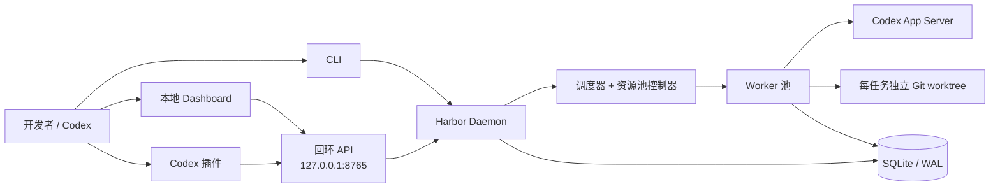
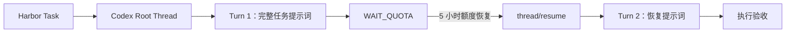

<div align="center">

# ⚓ Codex Harbor（代码港）

### 面向 Codex 的持久化任务编排器

将 Codex 会话变成可持久化、可调度的开发任务，并提供 Git worktree 隔离、
配额感知执行以及跨进程恢复能力。

[](https://github.com/Colin-Cai0318/codex-harbor/actions/workflows/ci.yml)
[](https://www.python.org/)
[](LICENSE)
[](#项目状态)
[](#环境要求)

[English](README.md) · **简体中文**

</div>

---

Codex Harbor 是构建在 Codex App Server 之上的本地优先控制平面。它使用
SQLite 保存调度状态、使用 Git worktree 隔离代码改动，并通过恢复信封确保
任务身份不依赖某个终端、Worker、Codex 进程或 Desktop 侧边栏。

> [!IMPORTANT]
> Codex Harbor 当前为 MVP。Windows Native 仍处于 Beta 阶段；升级 Codex CLI
> 后，应重新验证真实配额行为。

## 目录

- [为什么需要 Codex Harbor？](#为什么需要-codex-harbor)
- [系统架构](#系统架构)
- [TaskSession 与 Turn 的关系](#tasksession-与-turn-的关系)
- [核心能力](#核心能力)
- [环境要求](#环境要求)
- [快速开始](#快速开始)
- [注册本地仓库](#注册本地仓库)
- [配置说明](#配置说明)
- [YAML 任务文件](#yaml-任务文件)
- [CLI 命令参考](#cli-命令参考)
- [Codex 插件](#codex-插件)
- [持久化与恢复](#持久化与恢复)
- [开发与验证](#开发与验证)
- [安全边界](#安全边界)
- [项目状态](#项目状态)

## 为什么需要 Codex Harbor？

普通的交互式 Codex 会话依赖正在运行的客户端。Harbor 为长时间、多仓库开发
任务提供了独立且持久的生命周期：

| 需求 | Harbor 的处理方式 |
|---|---|
| 跨进程恢复 | 在 SQLite/WAL 中保存任务、Attempt、Codex Thread、Worker、配额和事件 |
| 安全并行 | 事务式领取任务，每个任务使用独立 Git worktree |
| 保证执行顺序 | 支持依赖关系、优先级 + FIFO 以及互斥组 |
| 应对配额暂停 | 任务状态机与资源池状态机分离，支持等待、排空、冻结和恢复 |
| 明确 Agent 配置 | 动态校验模型与推理等级能力，绝不静默降级 |
| 验证完成质量 | 执行验收命令，并可将失败结果交给后续 Turn 继续修复 |

## 系统架构



Daemon 统一管理一个 App Server 进程。模型和推理等级配置始终归属于具体任务，
不会通过 Worker 在任务之间泄漏全局 Agent 状态。

## Task、Session 与 Turn 的关系

Harbor 不会替代或绕开 Codex Session。它通过 App Server 把任务调度到持久化的
Codex Thread 中，因此对话记录仍保存在 Codex 自己的 Thread 存储里，并会以
`[T001] 任务标题` 这样的名称便于在 Codex 应用中识别。Harbor Dashboard 负责补充
生命周期、并发和额度控制，并不是另一套聊天记录系统。

| Harbor/Codex 对象 | 含义 | 生命周期 |
|---|---|---|
| Task | 业务目标、仓库、提示词、验收标准、依赖和调度状态 | 直到被显式删除 |
| Root Thread | 任务的主要 Codex Session 和对话历史 | 跨 Worker、App Server 重启复用 |
| Recovery Thread | 仅在原 Thread 无法恢复时 Fork 或新建 | 仍关联同一个 Task |
| Turn | Thread 内的一次提示词执行 | 与 Thread ID、执行轮次一起记录 |
| 计入预算的失败 | 会消耗失败重试上限的运行或验收失败 | 与 Turn 数量独立计算 |

正常关系是一个 Task 对应一个 Root Thread，并在其中产生多个 Turn。第一个 Turn
注入完整任务信封；验收反馈和额度重置后的恢复提示词会作为后续 Turn 注入同一
Thread。额度耗尽会记录为 `WAIT_QUOTA`：这个 Turn 和错误证据会保留，但不会增加
“计入预算的失败”数量。



即使 Daemon 或 App Server 在等待期间停止，SQLite 仍会保存 Task ↔ Thread 映射。
重启后，调度器会同时等待已记录的重置时间和实时额度恢复，然后先调用
`thread/resume`，再启动下一个 Turn；不会因为额度耗尽而创建一条脱离 Codex 的
替代 Session。

## 核心能力

### 持久化调度

- 持久化保存仓库、任务、依赖、Attempt、Thread、Worker、配额、资源池和事件。
- 通过事务领取任务，并按优先级/FIFO 排序。
- 支持依赖门禁、互斥组、并行 Worker、有限重试和验收失败后的后续 Turn。
- 提供 `WAIT_QUOTA`、`RETRY_WAIT`、`BLOCKED` 等任务状态，以及
  `DRAINING`、`FROZEN` 等独立资源池状态。
- 支持在运行时调整并持久化最大并行任务数（1–64）。

### 原生 Codex 集成

- 实现 App Server 初始化以及持久化 Thread/Turn 操作。
- 支持创建、读取、恢复和 Fork Codex Thread，不依赖内部 rollout JSONL 格式。
- 动态读取模型列表并验证所选推理等级是否受支持。
- 通过当前 App Server 协议读取结构化账户配额。

### 隔离、恢复与可观测性

- 在 Harbor 管理的 Git worktree 中创建 `harbor/<task-id>` 分支。
- 支持本地 Linux、Windows Native 和 WSL 执行后端。
- 保存恢复信封，并根据心跳识别失联 Worker。
- 持久化任务历史和命令输出前，对 Authorization、API Key、Cookie 和密码脱敏。
- 提供仅监听回环地址的 FastAPI 服务，以及支持白天/黑夜主题和中英文持久化切换的
  卡片式生命周期 Dashboard；额度卡片以剩余额度为主信息。

## 环境要求

- Python 3.11 或更高版本
- [uv](https://docs.astral.sh/uv/)
- Git
- 已安装并完成登录的 Codex CLI

Harbor 当前面向 Windows Native、Linux Native 和 WSL2。Windows Native 仍为
Beta；完整验证边界请参阅[项目状态](#项目状态)。

## 快速开始

### 1. 克隆并安装

```bash
git clone https://github.com/Colin-Cai0318/codex-harbor.git
cd codex-harbor
uv sync --extra dev
```

### 2. 初始化并检查运行环境

```bash
uv run harbor init
uv run harbor doctor
```

### 3. 注册仓库并创建任务

Harbor 注册的是已经 clone 到本机的 Git 工作区路径，不是 GitHub URL。以
`F:\BossHunter` 为例：

```powershell
uv run harbor repo add "F:\BossHunter"

uv run harbor task add `
  --repo "F:\BossHunter" `
  --title "完善 BossHunter 使用文档" `
  --prompt "检查现有 README，补充安装、启动和验证步骤；不要修改业务代码" `
  --backend windows `
  --reasoning high `
  --accept "git diff --check"
```

如果这里仍不清楚，请继续阅读下面的[注册本地仓库](#注册本地仓库)。

### 4. 启动 Harbor

```bash
uv run harbor daemon
```

浏览器打开 <http://127.0.0.1:8765> 使用 Dashboard；也可以在另一个终端查看
同一份持久化状态：

```bash
uv run harbor ps
uv run harbor task show T001
uv run harbor history T001
```

## 注册本地仓库

### “本地路径”和“GitHub 地址”分别有什么作用？

Harbor 当前只接受本地路径。GitHub 地址用于 `git clone`、`pull` 和 `push`，
不能直接传给 `harbor repo add`。

| 信息 | BossHunter 示例 | Harbor 是否直接使用 |
|---|---|---|
| 本地 Git 工作区 | `F:\BossHunter` | 是，注册和创建任务时都传这个路径 |
| GitHub 仓库 | [`Colin-Cai0318/BossHunter`](https://github.com/Colin-Cai0318/BossHunter) | 否，由本地 Git remote 管理 |
| Harbor 数据库 | 默认位于 `%LOCALAPPDATA%\CodexHarbor\harbor.db` | 是，保存注册信息和任务状态 |

`repo add` 不会下载代码。如果本地目录还不存在，需要先 clone：

```powershell
git clone https://github.com/Colin-Cai0318/BossHunter "F:\BossHunter"
```

你的目录已经存在时，不要重复 clone，直接执行后面的注册命令。

### 第一步：确认路径是可用的 Git 仓库

```powershell
Test-Path -LiteralPath "F:\BossHunter"
git -C "F:\BossHunter" rev-parse --show-toplevel
git -C "F:\BossHunter" rev-parse --verify HEAD
git -C "F:\BossHunter" remote -v
```

预期结果：第一条输出 `True`，第二条输出 `F:/BossHunter`，第三条能解析出
提交 ID。remote 可以叫 `origin`、`fork` 或其他名字，Harbor 不依赖 remote
名称。

> [!WARNING]
> Harbor 为任务创建的 worktree 基于仓库当前已提交的 `HEAD`。源工作区中的
> 未提交和未跟踪文件不会自动复制进任务 worktree；需要让任务看到的改动应先
> 正确提交，或者在任务 prompt 中明确安排其他安全的准备方式。

### 第二步：在 Codex Harbor 目录中注册

```powershell
cd "E:\Tools\Codex_Harbor"
uv run harbor repo add "F:\BossHunter"
```

成功时会输出类似内容：

```json
{
  "path": "F:\\BossHunter",
  "name": "BossHunter",
  "added_at": "2026-08-30T09:00:00+00:00"
}
```

重复执行是安全的：同一路径会更新现有注册记录，不会复制仓库，也不会修改
BossHunter 源工作区。注册命令不要求 daemon 已经启动。

### 第三步：确认注册结果

```powershell
uv run harbor repo list
```

输出中应包含 `F:\\BossHunter`。如果 Dashboard 已经打开，请刷新浏览器；之后
“新建任务”对话框的“仓库”下拉框中会出现 `BossHunter — F:\BossHunter`。

### 第四步：创建一个 BossHunter 示例任务

```powershell
uv run harbor task add `
  --repo "F:\BossHunter" `
  --title "完善 BossHunter 使用文档" `
  --prompt "检查现有 README，补充安装、启动和验证步骤；不要修改业务代码。完成后总结改动。" `
  --backend windows `
  --reasoning high `
  --accept "git diff --check"
```

命令只会把任务写入 Harbor 数据库。要实际执行任务，还需要启动调度器：

```powershell
uv run harbor daemon
```

浏览器打开 <http://127.0.0.1:8765>，或用以下命令确认任务状态：

```powershell
uv run harbor task list
uv run harbor ps
```

### 常见问题

| 现象 | 原因和处理 |
|---|---|
| `repository does not exist` | 本地路径不存在；检查盘符、目录名，并在包含空格时使用双引号 |
| `repository is not registered` | 创建任务使用了另一条路径，或命令连接了不同的数据目录；重新执行 `repo add` 并检查 `repo list` |
| `repo list` 仍是空数组 | CLI 与 daemon 可能使用了不同的 `HARBOR_DATA_DIR` 或 `--config`；两边必须使用同一配置 |
| GitHub URL 无法注册 | 这是预期行为；先 clone，再注册本地目录 |
| 任务中看不到本地未提交改动 | worktree 从已提交的 `HEAD` 创建；先处理并提交需要纳入任务的改动 |
| Dashboard 下拉框没有新仓库 | 刷新页面；仓库选项在页面载入时读取 |

## 配置说明

初始化配置结构可参考 [`config.example.toml`](config.example.toml)。关键默认值
有意保持保守：

| 配置项 | 默认值 | 用途 |
|---|---:|---|
| `harbor.bind` | `127.0.0.1` | Dashboard 与 API 仅监听本机回环地址 |
| `harbor.port` | `8765` | 本地 Dashboard/API 端口 |
| `scheduler.max_workers` | `3` | 最大并行 Worker 数量 |
| `quota.provider` | `codex` | 读取 Codex 账户的结构化配额 |
| `quota.freeze_on_weekly_reset` | `true` | 周配额重置时先排空既有任务再冻结资源池 |
| `codex.approval_policy` | `never` | 防止无人值守 Worker 卡在审批提示上 |
| `codex.sandbox` | `workspace-write` | 将 Agent 写入限制在任务工作区 |

`scheduler.max_workers` 用于初始化新数据库；初始化后可在 Dashboard 中实时修改，
新值会保存在 Harbor 数据库中。

测试另一套 Harbor 实例时，可使用独立数据目录：

```powershell
$env:HARBOR_DATA_DIR = 'D:\harbor-data'
uv run harbor init
```

## YAML 任务文件

任务既可以逐个创建，也可以从 YAML 导入：

```bash
uv run harbor task import docs/task-example.yaml
```

```yaml
id: T001
title: 新增 watchdog 解析器
repository:
  path: /absolute/path/to/repository
execution:
  backend: local
agent:
  model: null
  reasoning_effort: high
priority: 50
depends_on: []
exclusive_group: watchdog-parser
prompt: 实现解析器并保持现有行为不变。
acceptance:
  commands:
    - pytest tests/watchdog -q
max_attempts: 5
```

优先级数字越小越先执行；相同优先级按 FIFO 排序。`max_attempts` 表示计入预算的
失败重试上限，等待额度的 Turn 不会消耗它。

## CLI 命令参考

| 命令 | 用途 |
|---|---|
| `harbor init` | 创建数据目录、数据库和默认配置 |
| `harbor repo add\|list` | 注册或列出可用 Git 仓库 |
| `harbor task add\|import\|list\|show` | 创建和查看任务 |
| `harbor task config` | 调整任务的模型或推理等级 |
| `harbor task retry\|cancel\|cleanup` | 管理任务生命周期和 Harbor worktree |
| `harbor ps` | 查看资源池、Worker 和活动任务 |
| `harbor quota` | 查看最近一次持久化的配额窗口 |
| `harbor pause\|freeze\|resume` | 控制资源池任务准入 |
| `harbor run` | 运行调度器，直到当前工作稳定 |
| `harbor daemon` | 持续运行调度器与本地 Dashboard |
| `harbor logs TASK` | 查看持久化任务输出 |
| `harbor history TASK` | 查看任务事件时间线 |
| `harbor doctor` | 检查 Python、Git、SQLite、Codex、模型、配额和执行后端 |

使用 `uv run harbor <command> --help` 查看完整参数。

## Codex 插件

仓库在 [`integrations/plugins/codex-harbor`](integrations/plugins/codex-harbor)
中提供了已验证的开发版插件。其 `harbor-tasks` Skill 允许 Codex 通过本机回环
API 查看和管理任务池，并与 CLI、Dashboard 共享同一调度器和安全边界。

插件同时提供 [API 参考](integrations/plugins/codex-harbor/skills/harbor-tasks/references/api.md)
和[无第三方依赖的辅助脚本](integrations/plugins/codex-harbor/skills/harbor-tasks/scripts/harbor_api.py)。

## 持久化与恢复

Harbor 将 SQLite 作为控制平面的事实来源，将 Codex Thread 作为持久化执行上下文。
Phase 0 验证程序会启动 App Server 并完成一个 Turn，停止该进程，再用另一个进程
恢复同一 Thread、读取历史记录并完成第二个 Turn：

```bash
uv run python tools/app_server_poc.py --workspace .
```

本机验证数据写入 `.codex-harbor-poc/state.json`，并由 Git 忽略。

## 开发与验证

```bash
uv run pytest -q
uv run pytest --cov=codex_harbor --cov-report=term-missing
uv run python -m compileall -q src tools tests
uv run harbor doctor
```

CI 矩阵覆盖 Ubuntu、Windows 与 Python 3.11、3.13。确定性测试使用 Fake Runtime
和 Fake Quota Provider；App Server 恢复程序是真实集成验证门槛。

- [实现映射](docs/IMPLEMENTATION.md)
- [验证记录](docs/VALIDATION.md)
- [任务示例](docs/task-example.yaml)

## 安全边界

> [!WARNING]
> Harbor 不会自动合并任务分支，也不会自动删除成功任务的 worktree。清理始终需要
> 显式执行。

- 控制平面的事实来源是 SQLite，而不是聊天历史。
- 任务状态与资源池状态相互独立。
- 配额耗尽属于等待状态和已记录 Turn，但不计入失败重试预算。
- 模型能力不受支持时会阻塞任务，不会偷偷更换模型或推理等级。
- Codex 身份认证仍由 Codex 管理；Harbor 不保存其凭据。
- `task cleanup` 会校验已注册 Git Root，只删除指定的 Harbor worktree，并保留分支。
- API 默认仅监听回环地址，绝不会默认绑定 `0.0.0.0`。

## 项目状态

Codex Harbor v0.1 是可运行的 MVP。自动化测试、真实双进程 App Server 恢复、
真实隔离 worktree 任务以及回环 API 已在 Windows Native 上验证通过。

以下项目仍属于发布资格验证范围，当前不宣称已完整验证：真实 5 小时/周配额耗尽
周期、破坏性进程终止与宿主机重启、Linux/WSL 长时间运行，以及 Windows 服务
打包。精确证据请参阅[验证记录](docs/VALIDATION.md)。

## 许可证

本项目基于 [Apache License 2.0](LICENSE) 发布。
